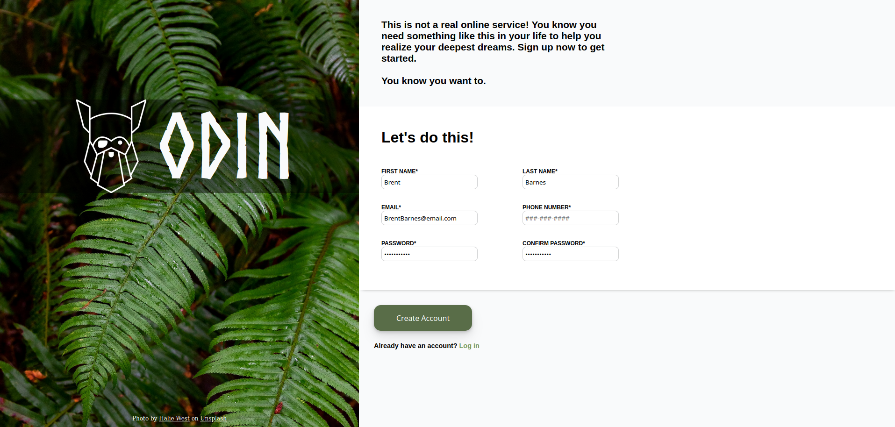

<h1>Sign Up Form</h1>
<ul>
<li>There was nothing too tricky about the design here. I mostly used flexbox to position all of the elements.</li>
<li>The inputs used some custom styling for the default outlines as well as the focused outline and box shadow.</li>
<li>Most validations used are the built in HTML validations. I did, however, use a pattern attribute for the telephone number to only accept inputs in the format of ###-###-####.</li>
</ul>
<h2>Final Project</h2>

&nbsp;

